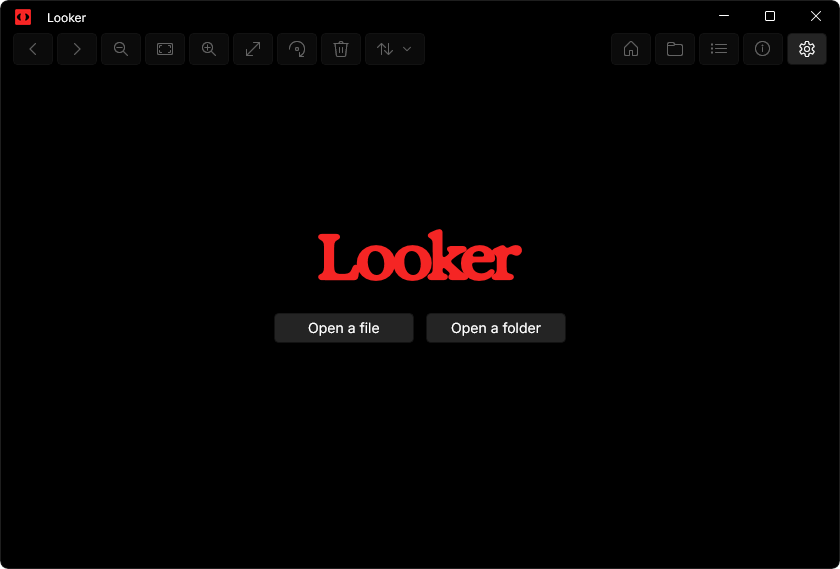
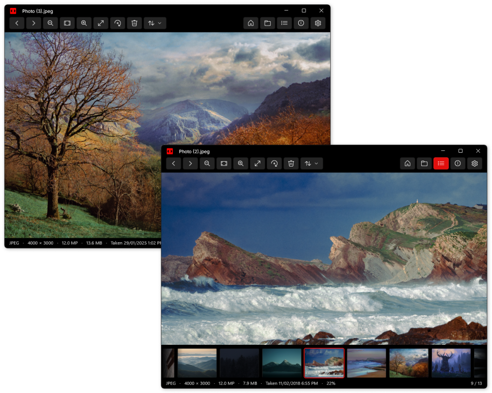

<p align="left">
  
</p>

A fast, minimal photo viewer for Windows 11.

**[Get it on the Microsoft Store](https://apps.microsoft.com/detail/9NV130N4C2GZ)**

## Features

- Opens instantly, straight into the photo.
- Browses the folder in Explorer order, with the next photos preloaded.
- File explorer, thumbnail strip, info panel with EXIF and histogram, fullscreen and slideshow.
- Rename, rotate and save, delete to Recycle Bin, copy, reveal in Explorer, set as wallpaper.
- Animated GIF, WebP and APNG playback.
- PDFs open as a row of pages: zoom and pan like a photo, turn pages with the page bar.
- Drag a photo or folder onto the window to open it.
- One window: opening another photo reuses it.

## Formats

JPEG, PNG/APNG, GIF, BMP, TIFF, WebP, ICO/CUR, JPEG XR, JPEG 2000, HEIC/HEIF/HIF, AVIF, JPEG XL, SVG, PDF, PSD/PSB, TGA, DDS, PCX, PPM/PGM/PBM, XCF, QOI, and camera RAW (CR2, CR3, CRW, NEF, NRW, ARW, SR2, SRF, DNG, ORF, RAF, RW2, PEF, SRW, 3FR, FFF, RWL, IIQ, MRW, DCR, KDC, ERF, MEF).

## Screenshots

<p align="left">
  
</p>

<p align="left">
  
</p>

## Keyboard

| Key | Action |
|---|---|
| `←` `→` | Previous / next |
| `Home` `End` | First / last |
| `Page Up` `Page Down` | Previous / next PDF page |
| Wheel, `Ctrl` `+` `-` | Zoom at the pointer |
| `Ctrl+0` or `F`, `1` | Fit, 100 % |
| Double-click | Toggle fit / 100 % |
| `Space` | Pause animation or slideshow |
| `F11`, `F5` | Fullscreen, slideshow |
| `E`, `T`, `I` | File explorer, thumbnail strip, info panel |
| `↑` `↓`, `Enter` | Walk the file explorer, open or close a folder in it |
| `Delete`, `F2` | Delete, rename |
| `Ctrl+R`, `Ctrl+Shift+R`, `Ctrl+S` | Rotate right / left, save rotation |
| `Ctrl+C`, `Ctrl+Shift+C`, `Ctrl+E` | Copy image, copy path, reveal in Explorer |
| `Ctrl+O`, `Ctrl+Shift+O` | Open file, open folder |
| `Ctrl+,` | Settings |
| `Esc` | Back |

The mouse wheel can step between photos instead of zooming (`Ctrl` + wheel still zooms), and zoom can be anchored on the middle of the view instead of the pointer. Looker remembers its window size and position unless you turn that off. All in Settings.

## Build from source

Requires Windows 11, the .NET 10 SDK and Developer Mode. Visual Studio is not needed.

```powershell
dotnet build src/Looker/Looker.csproj -c Debug -p:Platform=x64
Add-AppxPackage -Register "src/Looker/bin/x64/Debug/net8.0-windows10.0.26100.0/win-x64/AppxManifest.xml" -ForceUpdateFromAnyVersion
dotnet test tests/Looker.Tests -c Debug
```

Built with WinUI 3 and Win2D.
