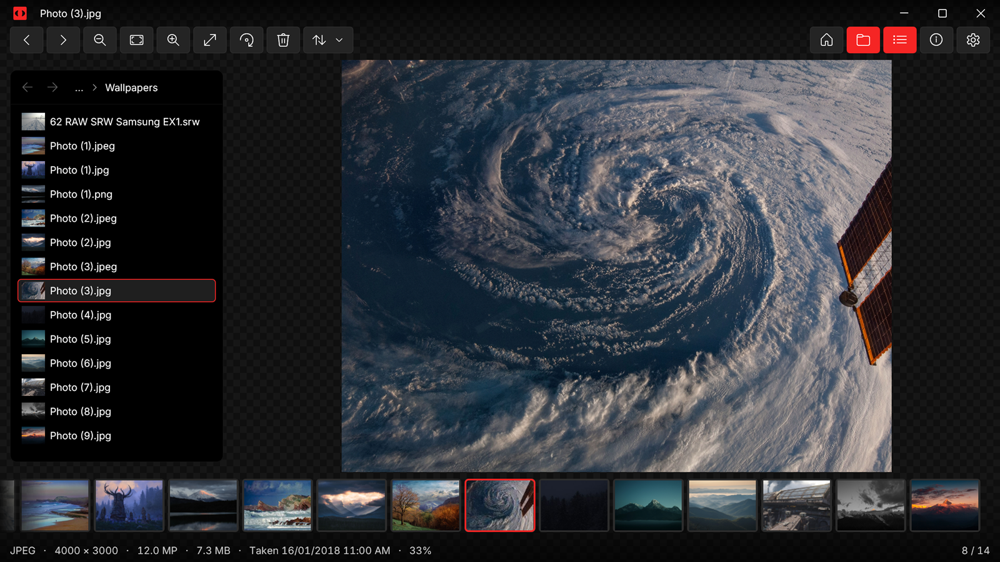
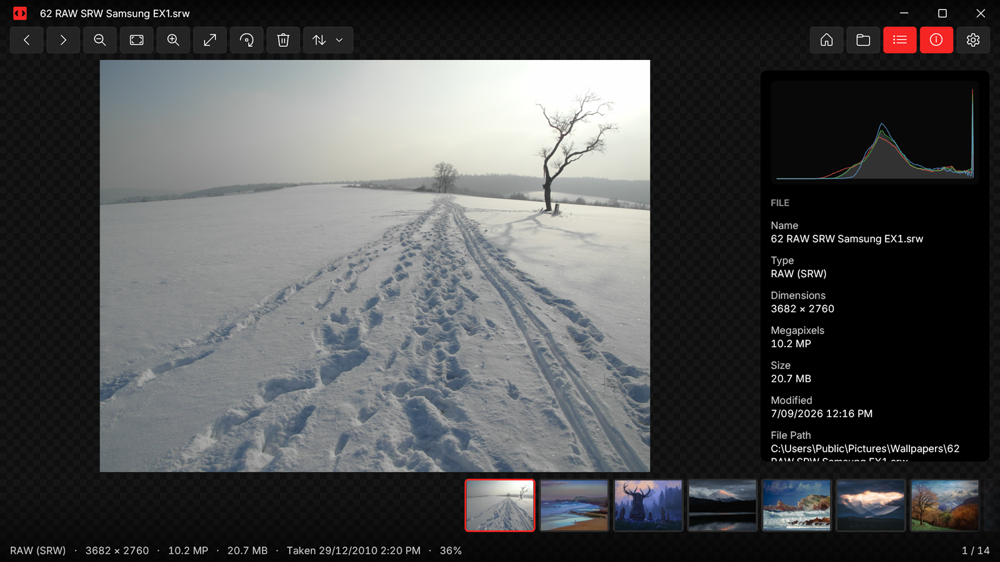

<p align="left">
  
</p>

A fast, minimal photo viewer for Windows 11.

<a href="https://apps.microsoft.com/detail/9NV130N4C2GZ?mode=direct">
  <picture>
    <source media="(prefers-color-scheme: dark)" srcset="https://get.microsoft.com/images/en-us%20light.svg">
    
  </picture>
</a>

## Features

- Opens instantly, straight into the photo.
- Browses the folder in Explorer order, with the next photos preloaded.
- File explorer, thumbnail strip, info panel with EXIF and histogram, fullscreen and slideshow.
- Rename, rotate and save, delete to Recycle Bin, copy, reveal in Explorer, set as wallpaper.
- The thumbnail strip and file explorer can also list files Looker can't open (right-click either): preview them with Windows' own thumbnail, step through them with `←` `→`, rename or delete them.
- Animated GIF, WebP and APNG playback.
- PDFs open as a row of pages: zoom and pan like a photo, turn pages with the page bar.
- Colour managed to the display, wide gamut included. With HDR on, HDR photos (gain-map JPEGs such as Ultra HDR, HDR AVIF, JPEG XR) show their full brightness.
- Drag a photo or folder onto the window to open it.
- One window: opening another photo reuses it.

## Formats

JPEG, PNG/APNG, GIF, BMP, TIFF, WebP, ICO/CUR, JPEG XR, JPEG 2000, HEIC/HEIF/HIF, AVIF, JPEG XL, SVG, PDF, PSD/PSB, TGA, DDS, PCX, PPM/PGM/PBM, XCF, QOI, and camera RAW (CR2, CR3, CRW, NEF, NRW, ARW, SR2, SRF, DNG, ORF, RAF, RW2, PEF, SRW, 3FR, FFF, RWL, IIQ, MRW, DCR, KDC, ERF, MEF).

## Screenshots

<p align="left">
  
</p>

<p align="left">
  
</p>

## Keyboard

| Key | Action |
|---|---|
| `←` `→` | Previous / next |
| `Home` `End` | First / last |
| `Page Up` `Page Down` | Previous / next PDF page; past a PDF's ends, top / bottom of the file explorer (or first / last photo) |
| Wheel, `Ctrl` `+` `-` | Zoom at the pointer |
| `Ctrl+0` or `F`, `1` | Fit, 100 % |
| Double-click | Toggle fit / 100 % |
| `Space` | Pause animation or slideshow |
| `F11`, `F5` | Fullscreen, slideshow |
| `E`, `T`, `I` | File explorer, thumbnail strip, info panel |
| `↑` `↓`, `Enter` | Walk the file explorer, open or close a folder in it |
| `Delete`, `F2` | Delete, rename |
| `Ctrl+R`, `Ctrl+Shift+R`, `Ctrl+S` | Rotate right / left, save rotation |
| `Ctrl+C`, `Ctrl+Shift+C`, `Ctrl+E` | Copy image, copy path, reveal in Explorer |
| `Ctrl+O`, `Ctrl+Shift+O` | Open file, open folder |
| `Ctrl+,` | Settings |
| `Esc` | Back |

The mouse wheel can step between photos instead of zooming (`Ctrl` + wheel still zooms), and zoom can be anchored on the middle of the view instead of the pointer. Looker remembers its window size and position unless you turn that off. All in Settings.

## Build from source

Requires Windows 11, Rust (stable, MSVC toolchain), the Windows SDK and Developer Mode.

```powershell
cd native; cargo build --release; cargo test --release; cd ..
pwsh scripts/Publish-Native.ps1          # install the build as the Looker package
pwsh scripts/Build-NativePackage.ps1 -Store   # Microsoft Store upload
```

Native Rust, drawn with Direct2D and DirectWrite, decoding through WIC. (Looker 1.0 was a WinUI 3 app; its source
is at the `csharp-final` tag.)
